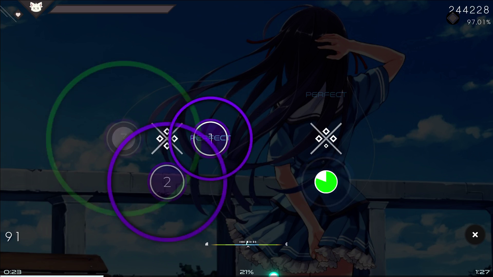
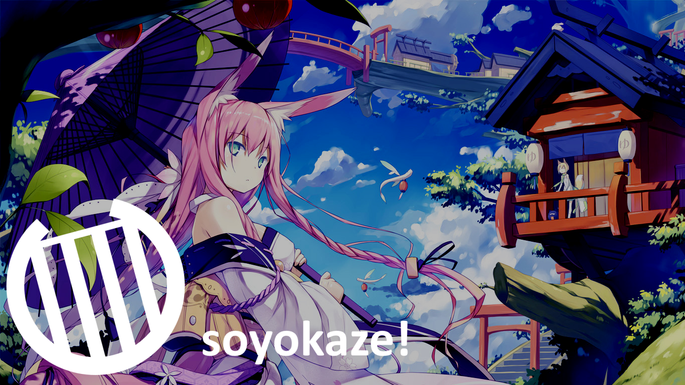
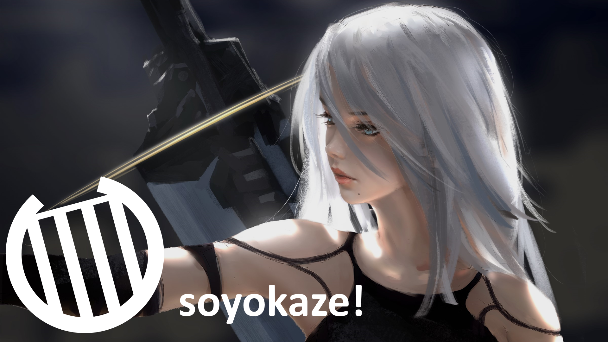

# soyokaze!

[](https://github.com/goodtrailer/soyokaze/releases/latest)
[](https://www.codefactor.io/repository/github/goodtrailer/soyokaze/overview/main)
[](https://github.com/goodtrailer/soyokaze/blob/master/LICENSE)
[](https://somsubhra.github.io/github-release-stats/?username=goodtrailer&repository=soyokaze&page=1&per_page=0)

An osu! ruleset mimicking Genshin Impact's Ballads of Breeze mini-game. You can also check it out over at [rūrusetto](https://rulesets.info/posts/soyokaze/), a website created by the [Rūrusetto team](https://github.com/Rurusetto) to catelog osu!lazer rulesets.

## Video Showcase (YouTube)
[](https://youtu.be/3Sj6tE2t4do)
| [](https://youtu.be/hWjG0W7EiAE) | [](https://youtu.be/uX0HBadqPzs) | [](https://youtu.be/_QKinzhlMes) |
| --- | --- | --- |

## Fun Maps for soyokaze!
* [Ren feat. Hatsune Miku - Tougetsu, Rinzen ni Kisu. [Touch Your Dreams]](https://osu.ppy.sh/b/2923009) 4.74⭐: Clean jump map for beginners

* [Ito Kanako - Skyclad no Kansokusha [Time Travel]](https://osu.ppy.sh/b/907850) 6.07⭐: A good generic map to get started with, plus some streams
* [Team Nekokan - Can't Defeat Airman [Holy Shit! It's Airman!!]](https://osu.ppy.sh/b/104229) 5.78⭐: The classic AR10 jump map, only now with a focus on reading
* [Rita - Tonitrus [Beyond the World]](https://osu.ppy.sh/b/1935726) 5.71⭐: An alt-map on osu!standard turned single-tap, yet still highly enjoyable
* [Idun Nicoline - Lost Without You (Boxplot Remix) [Wistful]](https://osu.ppy.sh/b/2725039) 6.08⭐: Heavy and stamina-intensive burst map
* [Niji no Conquistador - Zutto Summer de Koishiteru [Summer Love]](https://osu.ppy.sh/b/2625911) 5.89⭐: Overwhelming jump map with difficult triples
* [DUSTCELL - Anemone [Irrational]](https://osu.ppy.sh/b/2593243) 5.29⭐: Finger control is insane, see if you can resist cheesing and achieve an A rank
* [Camellia - fastest crash (Camellia's "paroxysmal" Energetic Hitech Remix) [Terminal Velocity]](https://osu.ppy.sh/b/2730082) 6.87⭐: Fun low BPM tech bursts
* [II-L - SPUTNIK-3 [Beyond OWC]](https://osu.ppy.sh/b/2719326) 7.10⭐: Rhythmic hell, except now even harder to read than ever before
* [Frederic - oddloop [oldloop]](https://osu.ppy.sh/b/1137879) 4.82⭐: Slap on +EZ and then thank the heavens above that soyokaze! has no notelock 
* [xi - Freedom Dive[FOUR DIMENSIONS]](https://osu.ppy.sh/b/129891) 9.48⭐: Maybe acc-able if you use two fingers to tap one key, possibly keyboard viable

## Skinning
Default skin PNGs (they're all white): [/osu.Game.Rulesets.Soyokaze/Resources/Textures/Gameplay/soyokaze](/osu.Game.Rulesets.Soyokaze/Resources/Textures/Gameplay/soyokaze).

Judgements and Hit Circle text are skinnable too following normal [osu!standard skinning guidelines](https://osu.ppy.sh/wiki/en/Skinning/osu%21).

`skin.ini` default values:
```
[General]
KiaiVisualizerDefaultSpin: 1.5
KiaiVisualizerKiaiSpin: -60
KiaiVisualizerDefaultOpacity: 128
KiaiVisualizerFirstFlashOpacity: 255
KiaiVisualizerFlashOpacity: 192

[Colours]
HoldHighlight: 0, 255, 0
KiaiVisualizerDefault: 47, 79, 79
KiaiVisualizerFirstFlash: 255, 255, 255
KiaiVisualizerFlash: 255, 255 255
```

## Features
1. No note-lock
1. 6 judgements (perfect, great, good, ok, meh, miss)
1. Combos & combo accents
1. Skinning
1. Settings
1. Key indicators
1. Basic mods (+HT, +DC, +DT, +NC, +HR, +EZ, +HD, +DA, +AT, +CN, +NF, +SD, +PF, +WU, +WD, +RD)
1. Replays
1. Kiai visuals
1. Post-beatmap statistics
1. Star-rating calculation
1. Holds mod (+HO)

## Extras
These are features that I think would be really fun, but are non-trivial to implement (unlike +DT, which took maybe 30 seconds). I may or may not implement these in the future depending on if I find the motivation to.
1. Spinners mod (+SP)
    * Basically just note spam, taiko/MuseDash style
1. Multi-notes mod (+MT)
    * Pretty hard mod to implement, would have to look at  for some clues, because I'm not sure how to decide when to do singles, doubles, and triples
1. Editor support
    * Currently unusable without a custom build of osu!, because the legacy beatmap decoder gets angry at non-legacy rulesets or something. Also definitely the hardest feature to implement by far
